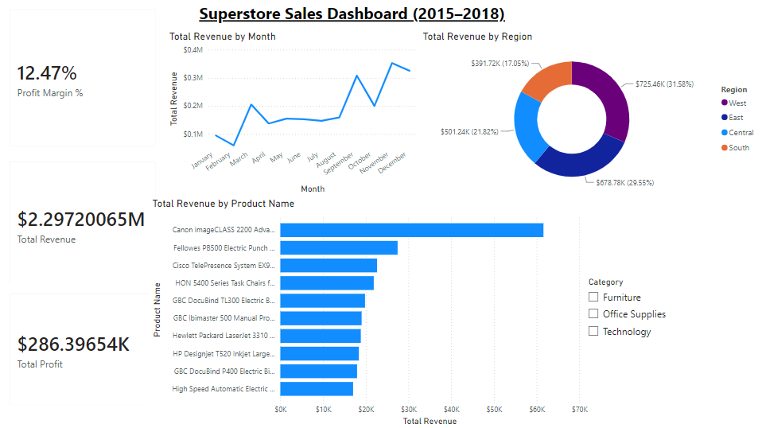

# Sales Analytics Project

End-to-end retail sales analytics pipeline on the Superstore dataset:
**clean raw data with Python/Pandas → query it with SQL → visualize it in Power BI.**

## Dashboard
The finished interactive Power BI dashboard ([`sales_dashboard.pbix`](sales_dashboard.pbix)):



## Tech Stack
- **Python** (Pandas, NumPy) — data cleaning & transformation
- **SQLite / SQL** — business queries (window functions, CTEs, aggregations)
- **Power BI** — interactive dashboard
- **Matplotlib** — static exploratory charts
- **Git / GitHub**

## Pipeline
| Stage | Script / File | Output |
|---|---|---|
| 1. Clean & transform | `src/clean_data.py` | `data/superstore_clean.csv`, `sales_clean` table |
| 2. Load to SQLite | `src/load_data.py` / `clean_data.py` | `database/sales.db` |
| 3. SQL analysis | `sql/business_queries.sql` | 10 business queries |
| 4. Python analysis | `src/analyze.py` | console KPIs & breakdowns |
| 5. Charts | `src/visualizations.py` | `charts/*.png` |
| 6. Dashboard | `POWER_BI_GUIDE.md` | `sales_dashboard.pbix` |

## Data Cleaning (src/clean_data.py)
Raw export had real quality issues, all handled programmatically:
- Removed **806 blank/null rows**
- Removed duplicate rows and duplicate Row IDs
- Parsed `Order Date` / `Ship Date` from inconsistent M/D/Y strings
- Fixed numeric/integer types
- Derived `Profit Margin`, `Order Year`, `Order Month`, `Shipping Days`

Result: a clean **9,994-row** dataset ready for SQL and Power BI.

## Key Findings
- Total revenue **$2.30M**, profit **$286K**, overall margin **12.47%**.
- **West** is the top region (~$725K); **Technology / Phones** drives the most revenue.
- Discounts above ~20% push average order profit **negative** — a clear margin leak.

## How to Run
```bash
pip install -r requirements.txt
python src/clean_data.py     # clean + load to SQLite + export clean CSV
python src/analyze.py        # print KPIs
python src/visualizations.py # generate charts
# then follow POWER_BI_GUIDE.md to build the dashboard
```

## Business Questions Answered
- Which products and categories generate the most revenue and profit?
- Which customers and segments are most valuable?
- Which regions perform best?
- How do discounts affect profitability?
- How is revenue trending month-over-month and year-over-year?
